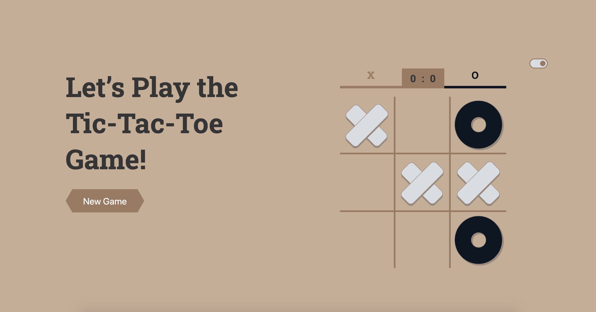
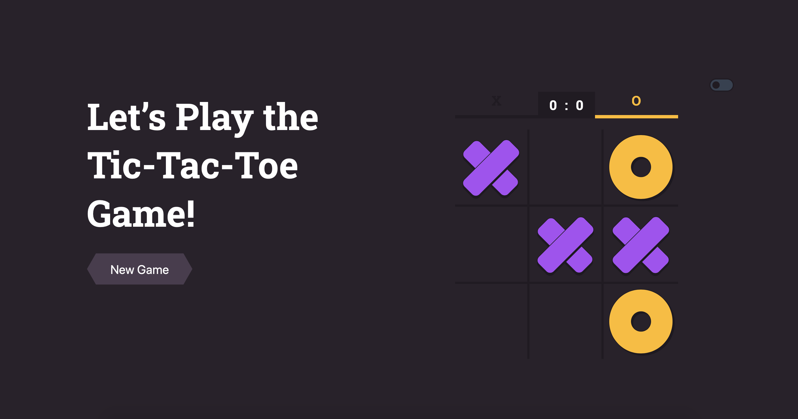

# Tic Tac Toe

Try the [Game](https://alisaliso.com/tictactoe/)



## Development

```
$ docker-compose up
$ docker-compose exec app sh
```

- `npm start` — This will spawn a development server with a default port of `3000`.
- `npm run build` — This will output a production build in the `dist` directory.
